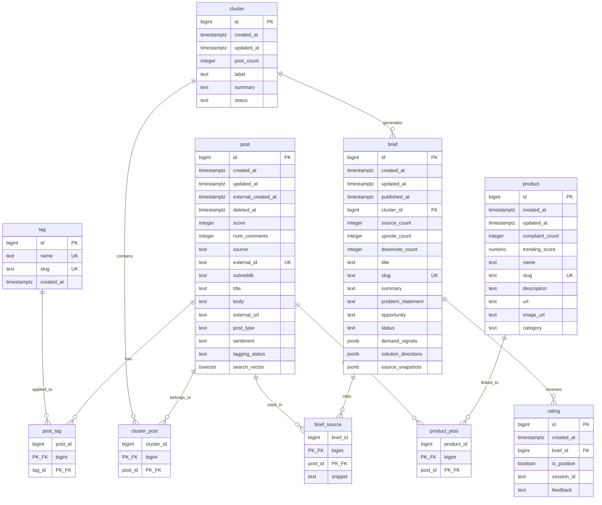

# idea-fork — Database Design

**Status**: Draft
**Database**: PostgreSQL 16 (Neon serverless)
**SADD Reference**: [docs/design-doc.md](/docs/design-doc.md)

---

## 1. Requirements Summary

### From SADD (Sections 4, 6.5)

- **Storage**: PostgreSQL (Neon) as sole data store. No Redis, no search service.
- **Consistency**: Strong consistency for all reads (single primary, no replicas in MVP).
- **Data volume**: 10K posts/day ingested, ~100 briefs/week, < 10K DAU.
- **Read/write ratio**: 100:1. Read-dominant with batch pipeline writes.
- **Retention**: Posts soft-deleted after 12 months. Briefs retained indefinitely.
- **Ingestion**: Pipeline batch writes (posts → tags → clusters → briefs). Upsert pattern for posts (Reddit posts may be re-fetched).

### Access Patterns

| Pattern | Query Shape | Frequency |
|---|---|---|
| Feed listing | Filter by tags + sort by recency or trending + keyset paginate | Very high |
| Feed keyword search | pg_trgm + tsvector on title/body | High |
| Brief listing | Sort by published_at + keyset paginate | High |
| Brief detail | Brief + source posts (denormalized in JSONB) | High |
| Product listing | Sort by trending_score or complaint_count + paginate | Medium |
| Product detail | Product + linked complaint posts | Medium |
| Rating submission | INSERT with unique constraint (brief_id, session_id) | Low |
| Pipeline: untagged posts | Filter by tagging_status = 'pending' | Low (batch) |

---

## 2. Entity Relationship Diagram



Full Mermaid source: [docs/erd.mermaid](/docs/erd.mermaid)

---

## 3. Schema Decisions & Trade-offs

### 3.1 Post: Generic Source Columns

Posts use `source` + `external_id` instead of Reddit-specific column names (`reddit_id`). This follows the SADD recommendation to "abstract data source layer for future platform additions" (Section 7, Risk Mitigation) with minimal overhead.

- `source`: platform identifier (`reddit`, `app_store`, `play_store`, `forum`)
- `external_id`: unique ID on the source platform
- `subreddit`: Reddit-specific metadata, nullable for non-Reddit sources
- Unique constraint on `(source, external_id)` prevents duplicate ingestion across re-fetches

### 3.2 Post Tagging: Structured Fields + Freeform Tags

LLM classification splits into two storage strategies:

| Classification | Storage | Rationale |
|---|---|---|
| `post_type` (complaint, feature_request, question) | Direct column with CHECK | Always exactly one value per post. Low cardinality, enumerable. |
| `sentiment` (positive, negative, neutral, mixed) | Direct column with CHECK | Same as above. |
| Category tags (SaaS, mobile app, etc.) | Separate `tag` table, many-to-many via `post_tag` | Open-ended, many-to-many. Primary feed filter target. |

TEXT + CHECK chosen over ENUM because tag categories may evolve as prompt engineering iterates. Adding/removing CHECK values requires only ALTER TABLE (no `ALTER TYPE` complications).

### 3.3 Brief: Dual Denormalization

Briefs store source post references in two places:

| Storage | Purpose | Consistency |
|---|---|---|
| `brief_source` table | Normalized FK relationship. Referential integrity. | Source of truth |
| `brief.source_snapshots` (JSONB) | Pre-computed display data for brief detail page. Avoids join on read. | Snapshot at brief generation time |

This follows the SADD explicitly: "Pre-computed source post references stored in brief row (denormalized JSON array of post IDs + snippets)" (Section 6.5). The normalized `brief_source` table ensures integrity; the JSONB serves the read path.

**`source_snapshots` schema:**
```json
[
  {
    "post_id": 123,
    "title": "Why is X so hard to use?",
    "snippet": "I've been trying to...",
    "external_url": "https://reddit.com/r/...",
    "subreddit": "SaaS",
    "score": 245
  }
]
```

**`demand_signals` schema:**
```json
{
  "post_count": 47,
  "subreddit_count": 5,
  "avg_score": 142.3,
  "newest_post_at": "2026-02-15T10:30:00Z",
  "oldest_post_at": "2026-01-01T08:00:00Z"
}
```

### 3.4 Brief Rating Counters

`brief.upvote_count` and `brief.downvote_count` are denormalized counters updated on rating submission. This avoids a `COUNT(*)` query on the `rating` table for every brief card render.

At MVP load (~50 ratings/day), updating these counters inline with the rating INSERT is sufficient. No need for async counter updates or materialized views.

### 3.5 Soft Delete on Posts

Posts use `deleted_at` timestamp for the 12-month archival policy (SADD Section 4.2). All read-path indexes are partial indexes with `WHERE deleted_at IS NULL` to exclude archived posts from active queries at zero cost.

### 3.6 No i18n Columns

All user-facing text (UI labels, navigation) is handled by `next-intl` on the frontend. Database content (posts, briefs, tags) is sourced from English-language platforms in MVP. No multi-language columns needed. If translated briefs are added post-MVP, a `brief_translation` table can be introduced.

---

## 4. Transaction Design

### Pipeline Batch Write

The pipeline processes data in sequential stages within a single batch:

```
Reddit fetch → store posts → LLM tag → update post types/tags → cluster → store clusters → LLM synthesize → store briefs
```

**Isolation level**: Read Committed (default). The pipeline is the only writer; no concurrent write conflicts.

**Transaction boundaries**: Each stage commits independently. If tagging fails, posts are stored with `tagging_status = 'failed'` and retried in the next run. Brief generation wraps the brief INSERT + brief_source INSERTs + source_snapshots JSONB in a single transaction.

**Concurrency guard**: Use an advisory lock to prevent overlapping pipeline runs:

```sql
SELECT pg_try_advisory_lock(1) AS acquired;
-- If false, another pipeline run is active; skip this execution.
```

### Rating Submission

Single transaction: INSERT rating + UPDATE brief counters.

```sql
BEGIN;
INSERT INTO rating (brief_id, session_id, is_positive)
VALUES ($1, $2, $3);

UPDATE brief
SET upvote_count = upvote_count + CASE WHEN $3 THEN 1 ELSE 0 END,
    downvote_count = downvote_count + CASE WHEN NOT $3 THEN 1 ELSE 0 END
WHERE id = $1;
COMMIT;
```

The UNIQUE constraint on `(brief_id, session_id)` prevents duplicate ratings. Duplicate attempts raise a constraint violation handled by the application (return 409 or update the existing rating).

**Isolation level**: Read Committed. Low contention (different sessions rate different briefs).

---

## 5. Index Strategy

### Feed Performance (Critical Path)

| Index | Type | Purpose |
|---|---|---|
| `idx_post_feed` | B-tree (partial) | Keyset pagination: `ORDER BY external_created_at DESC, id DESC WHERE deleted_at IS NULL` |
| `idx_post_subreddit` | B-tree (partial) | Filter by subreddit + sort by recency |
| `idx_post_search_vector` | GIN (partial) | Full-text search via `@@` operator |
| `idx_post_title_trgm` | GIN/pg_trgm (partial) | Fuzzy keyword search, LIKE '%keyword%' |
| `idx_post_tag_tag_id` | B-tree | Reverse lookup: find all posts for a tag (feed filtering) |

All post indexes are partial (`WHERE deleted_at IS NULL`) to exclude soft-deleted rows.

### Brief Performance

| Index | Type | Purpose |
|---|---|---|
| `idx_brief_published` | B-tree (partial) | Published briefs listing with keyset pagination |
| `idx_brief_cluster_id` | B-tree | FK index for cluster → brief lookups |
| `idx_brief_source_post_id` | B-tree | Reverse: find briefs citing a specific post |

### Product Performance

| Index | Type | Purpose |
|---|---|---|
| `idx_product_trending` | B-tree | Product listing sorted by trending score |
| `idx_product_complaints` | B-tree | Product listing sorted by complaint count |
| `idx_product_post_post_id` | B-tree | Reverse: find products linked to a post |

### Pipeline Performance

| Index | Type | Purpose |
|---|---|---|
| `idx_post_tagging_pending` | B-tree (partial) | Pipeline picks up untagged posts efficiently |
| `idx_cluster_active` | B-tree (partial) | Pipeline processes active clusters only |

### Index Design Rationale

- **Keyset pagination** over OFFSET: constant-time performance at any page depth.
- **Partial indexes** on soft-delete and status columns: index only the rows that queries actually access. At 12+ months of data, this saves significant space and keeps indexes hot in memory.
- **GIN + pg_trgm**: provides `LIKE '%keyword%'` search capability without a separate search service. Combined with tsvector for ranked full-text results. Acceptable quality for MVP; upgrade to Meilisearch/Typesense if relevance is insufficient.

---

## 6. Performance Notes

### Column Ordering

All tables order columns largest-to-smallest (BIGINT/TIMESTAMPTZ → INTEGER → TEXT/JSONB/BOOLEAN) to minimize alignment padding waste. At 10K posts/day this is marginal, but costs nothing to implement correctly.

### No Partitioning

At 10K posts/day, the post table reaches ~3.65M rows/year. PostgreSQL handles this comfortably with proper indexes. Partitioning adds operational complexity without benefit at this scale.

**Trigger**: If post table exceeds 50M rows, consider range partitioning by `external_created_at` (monthly partitions). The soft delete + archival policy should prevent this for several years.

### No Materialized Views

The SADD notes a 100:1 read/write ratio, but at < 10K DAU the absolute query volume is low. Direct queries with proper indexes are sufficient. No materialized views needed for MVP.

**Trigger**: If feed listing p95 latency exceeds 200ms, introduce a materialized view for the feed (refreshed every 5 minutes, matching Next.js ISR revalidation).

### Connection Pooling

Neon provides built-in pgbouncer-compatible connection pooling. The API server (FastAPI + SQLAlchemy async) uses asyncpg which works with Neon's pooled connection string in transaction mode.

### Upsert Pattern for Posts

Reddit posts may be re-fetched (updated scores, new comments). Use `INSERT ... ON CONFLICT` on `(source, external_id)`:

```sql
INSERT INTO post (source, external_id, title, body, ...)
VALUES ('reddit', $1, $2, $3, ...)
ON CONFLICT (source, external_id)
DO UPDATE SET score = EXCLUDED.score,
             num_comments = EXCLUDED.num_comments,
             updated_at = now();
```

---

## 7. Migration Plan

| File | Content |
|---|---|
| `api/migrations/001_initial_schema.sql` | Full DDL: extensions, functions, tables, indexes, triggers, comments |
| `api/migrations/001_initial_schema.rollback.sql` | Drops all objects in reverse dependency order |

### Post-Migration Checklist

1. Run `ANALYZE` on all tables after initial data load
2. Verify indexes with `EXPLAIN ANALYZE` on key queries (feed listing, brief detail)
3. Confirm `pg_trgm` extension is available on Neon
4. Test upsert pattern with sample Reddit data
5. Verify advisory lock works for pipeline concurrency guard

---

## 8. SADD Deviations

None. All system-level decisions follow the SADD as specified:
- PostgreSQL (Neon) as sole data store
- No Redis, no search service
- Strong consistency (single primary)
- Soft delete for post archival
- Denormalized JSONB for brief source snapshots
