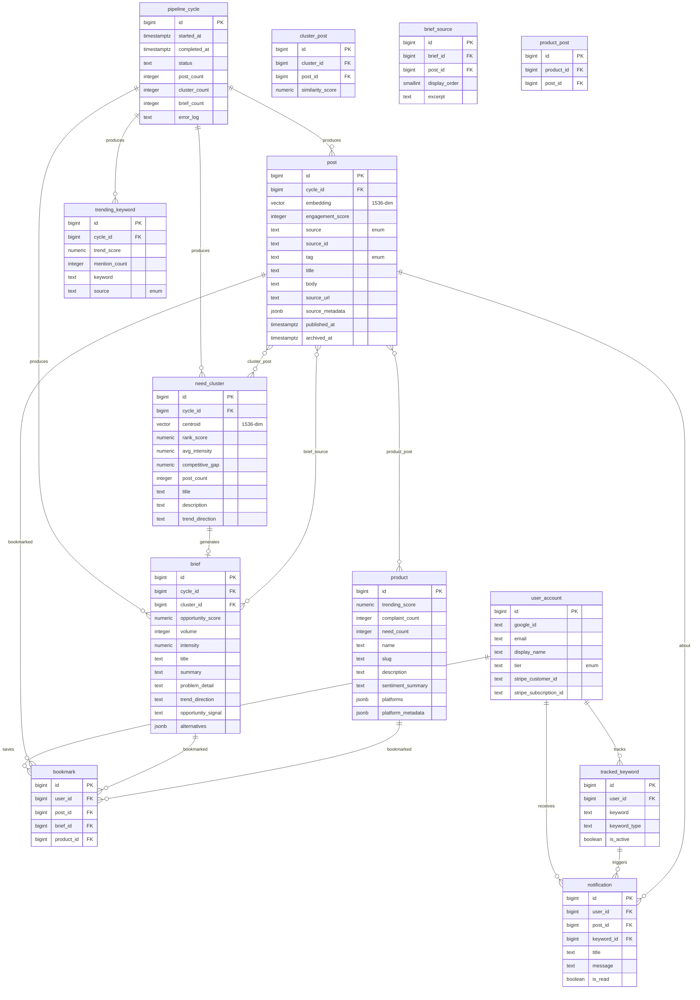

# idea-fork — Database Design Document

**Status:** Draft
**Author:** zzoo
**Date:** 2026-02-20
**References:** [PRD](./prd.md) | [Design Doc](./design-doc.md)

---

## 1. Requirements Summary

### Source Documents

- **SADD (Design Doc):** Defines Neon PostgreSQL + pgvector as the single data store. Layered architecture. Pipeline writes batch data every 6-24h; API reads for web frontend.
- **PRD:** 13 tables implied across pipeline (posts, clusters, briefs, products), user features (accounts, bookmarks, tracking, notifications), and infrastructure (pipeline cycles, trending keywords).

### Access Patterns

| Pattern | Type | Frequency | Latency Target |
|---------|------|-----------|---------------|
| Feed query (tag filter + engagement sort + cursor pagination) | Read | ~100K/day at 1K DAU | <10ms |
| Brief list by cycle + opportunity score | Read | ~30K/day | <10ms |
| Brief detail with source evidence | Read | ~10K/day | <20ms |
| Deep dive: need cluster + all source posts | Read | ~5K/day | <50ms |
| Product list by trending score | Read | ~10K/day | <10ms |
| Product detail with complaint breakdown | Read | ~3K/day | <50ms |
| Bookmark CRUD per user | Read/Write | ~5K/day | <20ms |
| Pipeline batch write (~2K posts/cycle) | Write | 1-4x/day | N/A (batch) |
| Pipeline cluster + brief generation | Write | 1-4x/day | N/A (batch) |
| Vector similarity search (clustering) | Read | Pipeline only | <100ms |

### Data Volume Estimates

| Table | Rows/cycle | 30-day total | 1-year total |
|-------|-----------|-------------|-------------|
| post | ~2,000 | ~60,000 | ~730,000 |
| need_cluster | ~50 | ~1,500 | ~18,000 |
| cluster_post | ~2,000 | ~60,000 | ~730,000 |
| brief | ~10 | ~300 | ~3,600 |
| brief_source | ~40 | ~1,200 | ~14,400 |
| product | ~50 (cumulative) | ~200 | ~2,000 |
| product_post | ~500 | ~15,000 | ~180,000 |
| trending_keyword | ~100 | ~3,000 | ~36,000 |
| user_account | — | — | ~10,000 (target) |
| bookmark | — | — | ~50,000 |

### Consistency Model

Strong consistency (from SADD Section 4.1). All reads and writes go to the primary Neon instance. No read replicas, no eventual consistency. Pipeline writes complete data atomically per stage before the next stage begins.

---

## 2. Entity-Relationship Diagram



Full standalone ERD: [docs/erd.mermaid](./erd.mermaid)

---

## 3. Schema Decisions & Trade-offs

### 3.1 Enum Strategy: TEXT with CHECK vs CREATE TYPE

**Decision:** Use `CREATE TYPE ... AS ENUM` for `post_source`, `post_tag`, `user_tier`, and `pipeline_status`.

**Rationale:** These enums have well-defined, rarely-changing values established in the PRD. PostgreSQL enums provide type safety at the database level and use 4 bytes of storage (vs variable-length TEXT). Adding new values is cheap (`ALTER TYPE ... ADD VALUE`); removing values requires a migration but is unlikely for these categories.

**Trade-off:** If tag categories change frequently during early iteration, TEXT with CHECK constraints would be easier to modify. We accept the enum approach because: (a) the PRD explicitly lists the tag categories, (b) the pipeline depends on these values, and (c) the performance benefit for the high-volume `post` table justifies it.

### 3.2 Post Source Metadata: JSONB Column

**Decision:** Platform-specific fields (Reddit upvotes, GitHub star_count, etc.) are stored in a single `source_metadata JSONB` column on the `post` table.

**Rationale:** Each source platform has different native fields:
- Reddit: `{ "subreddit": "SaaS", "upvotes": 150, "comment_count": 42 }`
- Product Hunt: `{ "product_name": "Notion", "upvotes": 300 }`
- Play Store: `{ "app_name": "Slack", "rating": 2, "helpfulness_votes": 10 }`
- GitHub: `{ "repo_name": "langchain", "language": "Python", "star_count": 50000, "star_growth_rate": 150, "fork_count": 8000 }`

**Alternatives rejected:**
- *Separate columns per platform field:* Would create 15+ nullable columns, most NULL for any given row. Sparse and hard to extend.
- *Table-per-source inheritance:* Over-engineered for the access pattern. The feed query reads all sources together; separate tables would require UNION ALL queries.

**Trade-off:** JSONB is not schema-enforced at the database level. Application-layer validation (Pydantic models per source type) ensures data integrity. GIN indexing on `source_metadata` is available if we need to query by platform-specific fields.

### 3.3 Normalized `engagement_score` Column

**Decision:** Store a pre-computed, cross-platform `engagement_score INTEGER` on the `post` table in addition to raw metrics in `source_metadata`.

**Rationale:** The feed query sorts by engagement score. Sorting by a JSONB field requires extraction (`source_metadata->>'upvotes'`) which cannot use a B-tree index efficiently. A denormalized integer column enables fast indexed sorting. The pipeline computes this score during the tagging stage using a platform-specific normalization formula.

### 3.4 Cluster-Post Relationship: Junction Table

**Decision:** Use a `cluster_post` junction table instead of a `cluster_id` FK on `post`.

**Rationale:**
- Clusters are re-computed each cycle over the last 30 days of posts. A post from cycle N may appear in cluster A in cycle N+1 and cluster B in cycle N+2.
- The junction table preserves the cluster assignment per-cycle without mutating the `post` row.
- `similarity_score` on the junction row captures how close the post is to the cluster centroid.

### 3.5 Brief Source Evidence: Normalized Table

**Decision:** Use a `brief_source` junction table instead of JSONB array on `brief`.

**Rationale:**
- FK integrity ensures source posts actually exist.
- Enables the reverse query: "which briefs reference this post?" (used in deep dive → related briefs).
- `display_order` controls the presentation order of evidence posts.
- `excerpt` stores the relevant snippet selected by the LLM during brief generation.

**Trade-off:** Slightly more complex write (insert brief + insert brief_sources) vs a single JSONB write. Acceptable because brief generation is batch (not latency-sensitive) and happens ~10 times per cycle.

### 3.6 Product Alternatives: JSONB on Brief

**Decision:** Store `alternatives` as JSONB on the `brief` table: `[{"name": "Notion", "shortcomings": "No offline mode, slow on mobile"}]`.

**Rationale:** Alternative products mentioned in briefs may not correspond to resolved `product` entities (they could be obscure tools or generic categories). Creating a normalized table would require entity resolution for every alternative mention — overkill for what is display-only data. JSONB is appropriate here because alternatives are written once (during brief generation) and read as a block (never queried individually).

### 3.7 Bookmark: Polymorphic via Separate FK Columns

**Decision:** The `bookmark` table has three nullable FK columns (`post_id`, `brief_id`, `product_id`) with a CHECK constraint ensuring exactly one is non-NULL.

**Rationale:**
- Maintains FK integrity to all three target tables (unlike a generic `target_type` + `target_id` pattern).
- Enables efficient per-type queries via partial indexes.
- The number of bookmarkable entity types (3) is small and stable.

**Alternative rejected:** Generic polymorphic (`target_type TEXT, target_id BIGINT`): Loses FK integrity, requires application-level joins, and prevents database-level referential constraint enforcement.

### 3.8 Soft Delete: `archived_at` on Posts Only

**Decision:** Only the `post` table uses soft delete (`archived_at TIMESTAMPTZ`). All other tables use hard deletes or are append-only.

**Rationale:** Per SADD Section 4.2: "Posts older than 90 days are archived (soft-deleted, excluded from feed queries but retained for brief source evidence)." Briefs, products, and clusters reference archived posts via FK — the posts must remain in the database for source evidence integrity. Other tables (bookmarks, tracked_keywords) can be hard-deleted because nothing references them.

**SADD deviation:** The SADD uses the term "soft-deleted" generically. We implement this as `archived_at` (not `deleted_at`) to clarify the semantics: archived posts are not "deleted" — they are intentionally retained for brief evidence but excluded from feed queries.

### 3.9 No Separate Notification Table in V1

**Decision:** Include the `notification` table in the schema but mark it as M4 (engagement milestone). The table is created in the initial migration for schema completeness, but the application will not write to it until M4.

**Rationale:** Creating the table upfront avoids a schema migration during M4. The table is lightweight (no indexes beyond PK and FK until M4).

---

## 4. Transaction Design

### 4.1 Pipeline: Cycle Write (Batch)

**Isolation:** Read Committed (PostgreSQL default).

**Strategy:** The pipeline writes in sequential stages within a single cycle. Each stage is its own transaction:

1. **Create cycle:** `INSERT INTO pipeline_cycle (status) VALUES ('running')` → returns `cycle_id`.
2. **Store posts:** Batch upsert ~2,000 posts. Use `INSERT ... ON CONFLICT (source, source_id) DO UPDATE` for idempotency. Single transaction, batched in groups of 500 rows.
3. **Store clusters:** Delete existing clusters for this `cycle_id` (if re-running), then insert new clusters + cluster_post rows. Single transaction.
4. **Store briefs:** Delete existing briefs for this `cycle_id` (if re-running), then insert briefs + brief_sources. Single transaction.
5. **Update products:** Upsert product entities and product_post mappings. Single transaction.
6. **Store trending keywords:** Delete + re-insert for this `cycle_id`. Single transaction.
7. **Complete cycle:** `UPDATE pipeline_cycle SET status = 'completed', completed_at = now(), post_count = ..., cluster_count = ..., brief_count = ...`.

**Why not one big transaction:** A single transaction spanning all stages would hold locks for 10-20 minutes, block API reads, and risk a full rollback if the last stage fails. Per-stage transactions allow partial cycles (if brief generation fails, the posts and clusters are still usable).

**Idempotency:** Re-running a failed cycle replaces partial data via upsert/delete-then-insert semantics. The `pipeline_cycle.status` field tracks progress.

### 4.2 Bookmark Create/Delete

**Isolation:** Read Committed.

**Strategy:** Simple single-row INSERT/DELETE. No contention concerns — bookmarks are per-user. The unique constraint `(user_id, post_id)` / `(user_id, brief_id)` / `(user_id, product_id)` prevents duplicates at the database level.

### 4.3 Stripe Webhook: Tier Upgrade

**Isolation:** Read Committed.

**Strategy:** `UPDATE user_account SET tier = 'pro', stripe_customer_id = ..., stripe_subscription_id = ... WHERE id = ...`. Single-row update. Stripe webhooks include an idempotency key; the application should check `stripe_subscription_id` before updating to prevent duplicate processing.

**No advisory locks needed:** User tier updates are low-frequency (upgrade/downgrade events) with no concurrent contention.

---

## 5. Index Strategy

### 5.1 Primary Query: Feed

```sql
-- Query pattern:
SELECT id, source, source_id, tag, title, body, source_url,
       engagement_score, source_metadata, published_at
FROM post
WHERE archived_at IS NULL
  AND tag IN ('complaint', 'need', 'feature_request')
  AND (engagement_score, id) < (:cursor_score, :cursor_id)
ORDER BY engagement_score DESC, id DESC
LIMIT 20;
```

**Indexes:**
- `idx_post_feed`: Composite on `(tag, engagement_score DESC, id DESC)` with partial `WHERE archived_at IS NULL`. This is the primary feed index — covers filtering by tag and sorting by engagement with cursor pagination.
- `idx_post_published_at`: On `(published_at DESC, id DESC)` with partial `WHERE archived_at IS NULL`. For time-based feed sorting (most recent).

**Selectivity:** `tag` has 6 values; feed typically filters to 3 (`complaint`, `need`, `feature_request`) = 50% selectivity. Combined with the sort columns, the composite index provides efficient range scans.

### 5.2 Pipeline: Upsert Dedup

```sql
-- Upsert pattern:
INSERT INTO post (cycle_id, source, source_id, ...)
VALUES (...)
ON CONFLICT (source, source_id) DO UPDATE SET ...;
```

**Index:** `uq_post_source_source_id`: Unique on `(source, source_id)`. Required for ON CONFLICT. Also serves as the idempotency key.

### 5.3 Vector Similarity: Clustering

```sql
-- Pattern (pipeline only):
SELECT id, embedding
FROM post
WHERE archived_at IS NULL
  AND created_at > now() - INTERVAL '30 days'
ORDER BY embedding <=> :query_vector
LIMIT 100;
```

**Index:** `idx_post_embedding_hnsw`: HNSW on `embedding` using `vector_cosine_ops`. Partial index `WHERE archived_at IS NULL`. HNSW chosen over IVFFlat because: (a) no training step required, (b) better recall at the expected scale (~60K vectors), (c) insert performance is acceptable for batch writes.

**HNSW parameters:** `m = 16, ef_construction = 64` (defaults). At 60K vectors with 1536 dimensions, build time is ~30-60 seconds and search time is <10ms. Revisit parameters if volume exceeds 500K vectors.

### 5.4 Briefs by Cycle

```sql
SELECT id, title, summary, opportunity_score, volume, cycle_id
FROM brief
ORDER BY cycle_id DESC, opportunity_score DESC
LIMIT 20;
```

**Index:** `idx_brief_cycle_score`: Composite on `(cycle_id DESC, opportunity_score DESC)`.

### 5.5 Need Clusters by Cycle

**Index:** `idx_need_cluster_cycle_rank`: Composite on `(cycle_id DESC, rank_score DESC)`.

### 5.6 Products by Trending Score

**Index:** `idx_product_trending`: On `(trending_score DESC)`.

### 5.7 Bookmarks per User

**Indexes:**
- `idx_bookmark_user_created`: Composite on `(user_id, created_at DESC)`. Primary query: "show my bookmarks, newest first."
- Three partial unique indexes for dedup:
  - `uq_bookmark_user_post`: `(user_id, post_id) WHERE post_id IS NOT NULL`
  - `uq_bookmark_user_brief`: `(user_id, brief_id) WHERE brief_id IS NOT NULL`
  - `uq_bookmark_user_product`: `(user_id, product_id) WHERE product_id IS NOT NULL`

### 5.8 FK Indexes (PostgreSQL Does NOT Auto-Index FKs)

All FK columns get explicit indexes unless already covered by a composite or unique index:

| FK Column | Table | Covered By |
|-----------|-------|-----------|
| `post.cycle_id` | post | `idx_post_cycle_id` |
| `need_cluster.cycle_id` | need_cluster | `idx_need_cluster_cycle_rank` |
| `cluster_post.cluster_id` | cluster_post | `idx_cluster_post_cluster` |
| `cluster_post.post_id` | cluster_post | `idx_cluster_post_post` |
| `brief.cycle_id` | brief | `idx_brief_cycle_score` |
| `brief.cluster_id` | brief | `idx_brief_cluster` |
| `brief_source.brief_id` | brief_source | `idx_brief_source_brief` |
| `brief_source.post_id` | brief_source | `idx_brief_source_post` |
| `product_post.product_id` | product_post | `idx_product_post_product` |
| `product_post.post_id` | product_post | `idx_product_post_post` |
| `bookmark.user_id` | bookmark | `idx_bookmark_user_created` |
| `bookmark.post_id` | bookmark | `uq_bookmark_user_post` (partial) |
| `bookmark.brief_id` | bookmark | `uq_bookmark_user_brief` (partial) |
| `bookmark.product_id` | bookmark | `uq_bookmark_user_product` (partial) |
| `tracked_keyword.user_id` | tracked_keyword | `idx_tracked_keyword_user` |
| `notification.user_id` | notification | `idx_notification_user` |
| `notification.post_id` | notification | `idx_notification_post` |
| `notification.keyword_id` | notification | `idx_notification_keyword` |
| `trending_keyword.cycle_id` | trending_keyword | `idx_trending_keyword_cycle` |

---

## 6. Performance Notes

### 6.1 Feed Query Performance

At 730K posts/year with ~550K non-archived (90-day window holds ~180K active):
- The partial index `idx_post_feed` covers only non-archived rows → smaller index, faster scans.
- Cursor-based pagination avoids OFFSET cost entirely.
- Estimated query time: <5ms with warm cache, <10ms cold.

### 6.2 Pipeline Write Performance

~2,000 posts per batch upsert. With `ON CONFLICT DO UPDATE`, PostgreSQL uses the unique index for conflict detection. At this volume, a single transaction completes in <2 seconds. The HNSW index rebuild after batch insert adds ~30-60 seconds (acceptable for a batch job).

**Optimization if needed:** Temporarily drop the HNSW index before bulk insert, recreate after. Only needed if pipeline duration exceeds 25 minutes.

### 6.3 Vector Search

pgvector HNSW on ~60K vectors (30-day window) with 1536 dimensions:
- Build time: ~30-60 seconds (pipeline only, not user-facing).
- Search time: <10ms per query.
- Memory: ~60K * 1536 * 4 bytes = ~370MB in index.

Neon's autoscaling handles this comfortably. No separate vector database needed at this scale.

### 6.4 Connection Pooling

Neon provides built-in connection pooling (pgbouncer). The API should use a pool size of 5-10 connections. The pipeline uses a single connection. At 1K DAU with ~10 QPS peak, this is well within capacity.

### 6.5 Archival Job

A scheduled job (weekly) should run:
```sql
UPDATE post
SET archived_at = now()
WHERE archived_at IS NULL
  AND published_at < now() - INTERVAL '90 days';
```

Batched in 1,000-row chunks to avoid long-running transactions. This is not latency-sensitive — run during off-peak hours.

---

## 7. Migration Plan

### 7.1 Initial Migration (M1)

File: `api/migrations/001_initial_schema.sql`

Creates all tables, enums, indexes, and constraints. Executed against Neon before first deployment. Rollback file: `api/migrations/001_initial_schema_rollback.sql`.

### 7.2 Migration Conventions

- All migrations are version-controlled SQL files (executed by Alembic in CI).
- Every migration has a corresponding rollback script.
- Migrations must be backwards-compatible: new code can run against old schema during rollout.
- Use `CREATE INDEX CONCURRENTLY` for indexes on existing tables (non-blocking).
- The initial migration uses `CREATE INDEX` (not CONCURRENTLY) since the tables are empty.

### 7.3 Phased Rollout

| Phase | Tables Actively Used |
|-------|---------------------|
| M1 — Pipeline | `pipeline_cycle`, `post`, `need_cluster`, `cluster_post`, `brief`, `brief_source`, `product`, `product_post`, `trending_keyword` |
| M2 — Feed + Briefs + Products | Same (read queries from API) |
| M3 — Auth + Pro | + `user_account` |
| M4 — Engagement | + `bookmark`, `tracked_keyword`, `notification` |

All tables are created in the initial migration regardless of phase. This avoids schema migrations at each milestone — only application code changes are needed.

### 7.4 Future Migrations (Anticipated)

- **Add email/password auth columns** (P1): `password_hash TEXT`, `email_verified BOOLEAN` on `user_account`.
- **Add product category/tags**: If product entity resolution evolves, may need a `product_category` table.
- **Partition `post` by `published_at`**: If post volume exceeds 5M rows, range-partition by month to improve archival and query performance.
