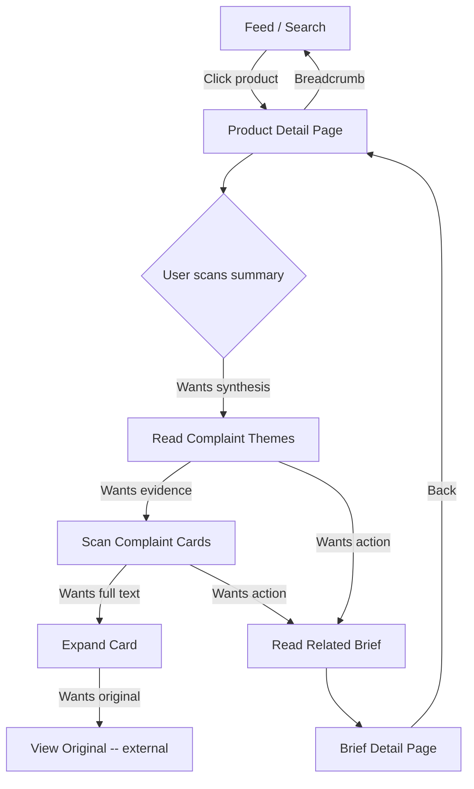

# UX Review: Product Detail Page (`/products/[slug]`)

**Date**: 2026-02-24
**Reviewer**: UX Design Skill (z-ux-design)
**Files reviewed**:
- `clients/web/src/views/product-detail/ui/product-detail-page.tsx`
- `clients/web/src/entities/product/ui/product-header.tsx`
- `clients/web/src/entities/product/ui/complaint-summary.tsx`

---

## 1. Context

### User Goal (JTBD)
> When I discover a product with complaints, I want to quickly understand **what users are upset about and how severe it is**, so I can decide whether this represents a viable problem space to build a solution for.

### User Context
- **Device**: Desktop-first (research task), but must work mobile (quick triage on the go)
- **Environment**: Focused research session or rapid scanning from feed
- **Mental state**: Evaluative -- the user is assessing opportunity size and problem clarity
- **Entry points**: Feed card click, search result, shared link, breadcrumb from brief

### Proto-Persona
```
Name:           Alex
Role:           Indie hacker exploring problem spaces
Goal:           Decide if this product's complaints represent a real, solvable opportunity
Context:        Laptop at home, coffee, scanning 10-20 products per session
Frustrations:   Wading through raw complaints without synthesis; dead-end pages
Tech comfort:   High
```

---

## 2. Findings

### CRITICAL -- Blocks the user's goal or violates core principles

---

#### C1. "Track Changes" CTA violates Zero Friction (P5) and is the wrong primary action

**What**: The primary button in ProductHeader is "Track Changes" with a bell-ring icon, styled as the page's most visually prominent action (primary blue, shadow-lg).

**Problem**: This button implies account creation / login (notification subscription). On a public, no-auth product, this is a dead-end CTA that violates **Principle 5: Zero friction** ("No login, no onboarding, no popups"). More fundamentally, the user's goal on this page is **evaluative** (assess opportunity), not **subscribe** (track over time). Tracking is a secondary, later-stage intent.

**Principle violated**: Von Restorff Effect -- the visually most distinct element (primary CTA) should be the ONE action that serves the user's primary goal. Currently, the most prominent action serves a minority use case.

**Recommendation**:
1. **Remove** "Track Changes" as the primary CTA entirely for MVP (no auth exists).
2. **Replace primary action** with something that serves the evaluative goal: "Read Related Brief" (links to the associated brief generated from this product's complaints). This directly serves the user's JTBD and connects to the cross-navigation requirement.
3. If "Track Changes" is needed later, add it as a **subdued secondary action** (ghost button or icon-only) after auth is implemented.

**Severity**: Critical -- the page's most prominent interactive element serves nobody's current goal.

---

#### C2. Themes are always empty -- the "so what" is missing

**What**: `ComplaintSummary` receives `themes={[]}` (hardcoded empty array). The component has theme support (`topTheme` logic) but never receives data.

**Problem**: The three summary cards show **quantitative metrics** (Total Mentions, Critical Complaints, Sentiment Score) but zero **qualitative synthesis**. The user gets numbers without meaning. "142 total mentions" does not tell the user **what** people are complaining about. This violates the page's stated purpose from the UX spec: "Complaint Summary (themes ranked by count)."

**Principle violated**: Cognitive Load Theory -- the user must scan all raw complaints to extract patterns themselves, which is the exact cognitive labor this AI product should eliminate. Also violates **Principle 4: Evidence is visible** -- AI-generated themes with source counts are the evidence layer.

**Recommendation**:
1. **Populate themes from the backend** (the API should return clustered complaint themes with counts).
2. **Add a Complaint Themes section** between the summary cards and the raw complaint list. This is the "so what" layer -- show 3-5 themes ranked by frequency, each with:
   - Theme name (e.g., "Slow sync performance")
   - Complaint count
   - Representative quote snippet
   - Clickable to filter complaints below to that theme
3. This creates the progressive depth the page currently lacks: Numbers (summary) -> Themes (synthesis) -> Raw complaints (evidence).

**Severity**: Critical -- without themes, the page fails to deliver on the product's core value proposition (AI synthesis of complaints).

---

#### C3. No Related Brief section -- dead-end page violates cross-navigation

**What**: The UX spec requires a "Related Brief" section. The implementation has none. The page ends after the complaint list.

**Problem**: This violates the cross-navigation principle: "Every entity links to related entities... products link to complaints and related briefs. No dead ends." After evaluating complaints, the user's natural next step is "Is there a brief that synthesizes this into an actionable opportunity?" With no path to briefs, the user must manually navigate back to the feed and search. This is a **dead end** in the discovery journey.

**Principle violated**: Goal Gradient Effect -- the user is progressing toward their goal (finding a viable problem to solve) and the page stops their momentum at the worst moment. Also violates Peak-End Rule -- the page ends with raw complaint data instead of a compelling next step.

**Recommendation**:
1. **Add a "Related Brief" card** at the bottom of the page, after complaints. If a brief exists for this product:
   - Show brief title, summary snippet, heat badge, source count
   - Primary CTA: "Read Full Brief" linking to `/briefs/[slug]`
2. If no brief exists yet:
   - Show an empty state: "No brief generated yet for this product. Briefs are created when enough complaint patterns emerge."
3. This creates the discovery loop: Feed -> Product -> Complaints -> Brief -> Back to feed.

**Severity**: Critical -- page is a dead end that breaks the product's discovery flow.

---

### IMPORTANT -- Significant friction or missed opportunity

---

#### I1. Information hierarchy inverted -- numbers before synthesis

**What**: The page layout is: Header -> Summary Cards (numbers) -> Raw Complaints. There is no synthesis layer between the numbers and the raw data.

**Problem**: The user must mentally process the jump from "142 mentions, 67 critical, sentiment 34/100" to a wall of individual complaint cards. The question "What are the top 3 things people hate about this product?" is never explicitly answered. The page dumps data but doesn't interpret it.

**Principle violated**: Progressive Disclosure (IA Principle of Disclosure) -- "Show only enough information to help users understand what they'll find if they dig deeper." The page violates this by going from abstract numbers directly to granular posts, skipping the middle layer of synthesis.

**Recommendation**: Insert a **Complaint Themes** section between summary cards and raw complaints:
```
Header (identity: what product?)
  -> Summary Cards (scale: how big is this?)
    -> Complaint Themes (synthesis: what are the patterns?)
      -> Raw Complaints (evidence: show me the posts)
        -> Related Brief (action: what can I build?)
```

This creates a 4-layer progressive depth model that matches the user's evaluation process.

**Severity**: Important -- the page has the data but presents it in the wrong order for decision-making.

---

#### I2. Summary cards show misleading/meaningless metrics

**What**: The fallback logic for summary cards is:
```tsx
criticalComplaints={product.metrics?.negative_count ?? product.posts.length}
sentimentScore={product.metrics?.sentiment_score ?? Math.round(product.trending_score)}
```

**Problem**:
- **Critical Complaints fallback to `posts.length`**: If `metrics.negative_count` is null, ALL posts are shown as "critical." This is misleading -- a product with 50 posts would show "50 Critical Complaints" even if only 5 are negative.
- **Sentiment Score fallback to `trending_score`**: Trending score is a completely different metric (popularity/velocity) being displayed as sentiment. A highly trending product with positive sentiment would show a high "sentiment score" -- which happens to be correct by accident -- but a highly trending product with terrible sentiment would also show a high score, which is wrong.
- **"Requires attention" subtitle**: When themes are empty, the Critical Complaints card shows "Requires attention" -- a vague, unactionable label.

**Principle violated**: UX Writing rules -- "Never use technical language" and "Be specific about what failed." Also violates Principle 4 (Evidence is visible) -- these numbers are not honest representations of the underlying data.

**Recommendation**:
1. Show metrics only when the backend provides them. If `metrics` is null, show an explicit "Not enough data" state rather than misleading fallbacks.
2. Replace "Requires attention" with the actual top theme when available, or hide the subtitle entirely.
3. Consider whether all 3 cards are needed. "Total Mentions" and "Critical Complaints" could be combined into a single card showing the ratio.

**Severity**: Important -- users will make decisions based on incorrect numbers.

---

#### I3. Complaint cards prioritize source metadata over content

**What**: Each complaint card layout is: Source badge + time + sentiment (top row) -> Title -> 2-line body -> Footer (score + View Original).

**Problem**: The first thing the user sees on each card is the source (Reddit, App Store) and a colored circle. But the user's primary need when scanning complaints is **what is this complaint about?** The title should be the most prominent element, with source as secondary metadata.

**Principle violated**: Content Hierarchy (design-process Step 3c) -- "What does user need FIRST? -> Top of screen." The answer is the complaint content, not its source platform.

**Recommendation**:
1. Move the **title to the top** of the card as the first visual element.
2. Move source + time + sentiment to a **compact metadata row below** the title, or as inline badges after the title.
3. Consider showing 3 lines of body text instead of 2 -- the extra line often contains the specific pain point.

Card layout should become:
```
Title (h3, prominent)
Body snippet (3 lines)
Source badge | Time | Sentiment badge | Score
```

**Severity**: Important -- users scan cards by content, not by source platform.

---

#### I4. "View Original" is the only card action -- wrong priority

**What**: The only interactive element on each complaint card (besides the hover effect) is "View Original" which opens an external URL.

**Problem**: This sends users away from the product. The product's value is synthesis, not just aggregation. If the primary card action sends users to Reddit, they might as well just search Reddit directly. The page should prioritize keeping users in the discovery flow.

**Principle violated**: Peak-End Rule / Goal Gradient -- each card interaction pushes users away from their goal (evaluating opportunity) rather than deeper into it.

**Recommendation**:
1. Make complaint cards **expandable** (click to show full body text instead of the 2-line clamp). This keeps users on the page.
2. Move "View Original" to be a **secondary link** visible only in the expanded state, or as a subtle icon-only link.
3. If themes are implemented (C2), clicking a complaint could highlight which theme it belongs to.

**Severity**: Important -- the only user action on the page's main content section exits the product.

---

#### I5. Sort controls lack a "Severity" option

**What**: Sort options are "Recent" and "Popular" (by score).

**Problem**: For the target user evaluating a problem space, neither "recent" nor "popular" directly serves their goal. They want to see the **most painful / most severe complaints first** to assess opportunity quality. Popularity (upvotes) is a proxy but not the same thing -- a meme post might be popular while a deeply frustrated user's post might have few upvotes.

**Recommendation**:
1. Add a third sort option: **"Most Critical"** -- sort by sentiment severity (frustrated/bug_report first, then feature_request, then question).
2. Consider making "Most Critical" the **default** sort -- it best serves the evaluative JTBD.

**Severity**: Important -- the default sort does not match the user's primary evaluation need.

---

#### I6. "Active" status badge is non-informative

**What**: ProductHeader always shows a green "Active" status badge next to the product name. The value is hardcoded: `status="Active"`.

**Problem**: If every product shows "Active," the badge carries zero information. It takes up visual space and attention (green badge next to the title is visually prominent due to Von Restorff) without communicating anything useful.

**Principle violated**: First Principles (#3: "What can be removed? If removing it doesn't block the goal, remove it"). Also violates the anti-pattern: "Elements that exist 'because other apps have it.'"

**Recommendation**: Remove the status badge until there are actual distinct statuses (Active, Discontinued, Acquired, etc.) that help users make decisions. If status variety exists in the data model, show it. If not, remove it.

**Severity**: Important -- visual noise competing with meaningful information.

---

### NICE-TO-HAVE -- Polish and optimization

---

#### N1. Complaint cards are visually heavy on mobile

**What**: Each card has: 32px source circle + text row + title + body + divider + footer row. This creates tall cards with ~5 distinct visual layers.

**Problem**: On mobile (375px width), showing 4 cards initially means significant scrolling before seeing the "Show all" button. The source circle (32px) + metadata row adds ~40px of height before the user sees the complaint content.

**Principle violated**: Fitts's Law / thumb-zone ergonomics -- primary actions and content should minimize scroll distance on mobile.

**Recommendation**:
1. Reduce to **3 initial cards on mobile** (4 on desktop).
2. Condense the metadata row: inline the source as text-only (no circle avatar), combine with time.
3. Consider a more compact card variant for mobile that drops the border-t footer divider.

**Severity**: Nice-to-have -- functional but suboptimal for mobile scanning.

---

#### N2. Max container width (1440px) is too wide for reading content

**What**: `max-w-[1440px]` on the page container.

**Problem**: On wide screens, complaint cards stretch to ~1400px. Reading long complaint text across this width exceeds the optimal line length of 50-75 characters (ergonomics.md). The brief detail page uses `max-w-[1280px]` with a sidebar, which is more appropriate.

**Recommendation**:
1. Reduce max-width to `max-w-5xl` (1024px) or `max-w-6xl` (1152px) for single-column content.
2. Alternatively, adopt a 2-column layout like the brief detail page: main content (complaints) + sidebar (summary cards, related brief). This would also solve the progressive depth issue (I1).

**Severity**: Nice-to-have -- readability optimization for wide screens.

---

#### N3. Missing accessible labels on sort buttons

**What**: Sort buttons ("Recent" / "Popular") toggle an active state but have no `aria-pressed` or `role="tablist"` / `role="tab"` semantics.

**Problem**: Screen readers cannot determine which sort is currently active. The active state is communicated only through visual styling (blue background vs gray).

**Principle violated**: Accessibility -- "Color not sole indicator of state" and "Screen reader labels on all interactive elements."

**Recommendation**:
1. Add `aria-pressed={sortBy === "recent"}` to each button, OR
2. Use a `role="tablist"` pattern with `role="tab"` and `aria-selected`.
3. Ensure the selected state has a non-color indicator (e.g., the current shadow-sm is good, but confirm contrast).

**Severity**: Nice-to-have -- accessibility compliance.

---

#### N4. Sentiment badge color relies on color alone

**What**: Sentiment badges (frustrated, featureRequest, question, bugReport) use different `variant` colors to distinguish types.

**Problem**: If the Badge component uses color as the primary differentiator (e.g., red for frustrated, blue for question), color-blind users cannot distinguish between sentiment types.

**Principle violated**: Accessibility -- "Never use color as the only indicator of state."

**Recommendation**: Verify that Badge component includes an icon or text label (it does appear to show text labels from the translation keys, which is good). Confirm the badge text alone communicates the sentiment without relying on color.

**Severity**: Nice-to-have -- likely already mitigated by text labels, but should be verified.

---

#### N5. No empty state for zero complaints

**What**: If `product.posts` is empty, the page would show the section header "User Complaints (0)" with no content beneath it.

**Problem**: Missing empty state design. Per interaction-patterns.md, the empty state should explain why it's empty and provide guidance.

**Principle violated**: The 7 Universal Screen States -- empty state not designed.

**Recommendation**: Add an empty state:
```
No complaints found yet.
This product hasn't generated enough user feedback for analysis.
Check back later or explore other products.
[Browse Products]
```

**Severity**: Nice-to-have -- edge case, but a blank section looks broken.

---

#### N6. Hardcoded "in" prefix in source label

**What**: Line 239: `in {srcCfg.label}` -- the word "in" is hardcoded in English, not going through i18n.

**Problem**: Violates the i18n convention ("Use `next-intl` for all UI text"). Will break in Korean localization.

**Recommendation**: Move "in {source}" to a translation key like `t("sourceIn", { source: srcCfg.label })`.

**Severity**: Nice-to-have -- i18n compliance.

---

## 3. Recommended Page Architecture (Redesign)

Based on the findings above, the recommended information architecture:

```
Breadcrumbs: Products > {product.name}

HEADER SECTION
  - Product icon (64px -- reduce from 96px), name (h1), category, website link
  - No status badge (remove "Active")
  - No "Track Changes" button (remove)

SUMMARY SECTION (3 cards)
  - Total Mentions (with trend)
  - Negative Sentiment % (replacing misleading "Critical Complaints")
  - Top Theme (replacing generic "Sentiment Score")
  - Only show when real metrics exist; hide section if no data

COMPLAINT THEMES SECTION [NEW]
  - h2: "What Users Complain About"
  - 3-5 theme chips/cards ranked by count
  - Each shows: theme name, count, representative quote
  - Clickable to filter complaint list below

COMPLAINT LIST SECTION
  - h2: "Source Posts" with count
  - Sort: Most Critical (default) | Recent | Popular
  - Cards: title-first layout, expandable body, "View Original" as secondary
  - Progressive load: 4 initially, "Show all N" toggle

RELATED BRIEF SECTION [NEW]
  - h2: "Related Brief"
  - Brief card with title, summary, heat badge
  - Primary CTA: "Read Full Brief"
  - Empty state if no brief exists

Cross-navigation footer:
  - "Explore similar products" or "Back to feed"
```

### Flow Diagram



---

## 4. Checklist Evaluation

### Goal & Structure
- [x] User's ONE goal identified (evaluate problem opportunity)
- [ ] **FAIL**: Not every element serves the goal ("Track Changes", "Active" badge)
- [ ] **FAIL**: IA depth missing (no themes layer, no related brief)
- [x] Navigation pattern appropriate (stack nav with breadcrumbs)

### Screen Design
- [ ] **FAIL**: Primary action is wrong ("Track Changes" instead of "Read Brief")
- [ ] **FAIL**: Information shown includes non-essential items (Active badge, misleading metrics)
- [ ] **PARTIAL**: States designed (skeleton yes, error yes, empty missing, offline not addressed)
- [ ] **FAIL**: Content hierarchy inverted (numbers before synthesis)

### Interaction
- [x] Feedback exists for sort button toggle
- [x] Loading skeleton present
- [ ] **FAIL**: No undo or inline expansion for complaint cards
- [x] Gestures have visible alternatives (N/A for web)

### Copy
- [ ] **FAIL**: "Track Changes" is vague for users without accounts
- [x] Error state has retry action
- [ ] **FAIL**: Empty state for zero complaints missing
- [x] No jargon (mostly -- "sentiment score" may confuse some users)

### Accessibility
- [x] Breadcrumbs have aria-label
- [x] Section has aria-labelledby
- [x] Focus-visible styles present on buttons
- [ ] **FAIL**: Sort buttons lack aria-pressed state
- [ ] **VERIFY**: Badge sentiment colors may rely on color alone
- [x] Progressbar has ARIA attributes

### Anti-patterns
- [x] No marketing copy in flow
- [ ] **FAIL**: "Active" badge exists without purpose
- [x] No confirmation dialogs for non-destructive actions
- [ ] **FAIL**: Dead-end page (no cross-navigation to briefs)

---

## 5. Priority Implementation Order

| # | Fix | Severity | Effort | Impact |
|---|-----|----------|--------|--------|
| 1 | Remove "Track Changes", add "Read Related Brief" CTA | Critical | Low | High |
| 2 | Add Related Brief section at bottom | Critical | Medium | High |
| 3 | Populate complaint themes from backend | Critical | High (API + frontend) | Very High |
| 4 | Fix misleading metric fallbacks | Important | Low | Medium |
| 5 | Restructure complaint cards (title-first) | Important | Low | Medium |
| 6 | Add theme section between summary and complaints | Important | Medium | High |
| 7 | Remove "Active" badge | Important | Trivial | Low |
| 8 | Add "Most Critical" sort default | Important | Low | Medium |
| 9 | Make complaint cards expandable | Important | Medium | Medium |
| 10 | Add ARIA states to sort buttons | Nice-to-have | Trivial | Low |
| 11 | Fix i18n hardcoded "in" | Nice-to-have | Trivial | Low |
| 12 | Add empty state for zero complaints | Nice-to-have | Low | Low |
| 13 | Reduce max-width for readability | Nice-to-have | Trivial | Low |
| 14 | Optimize card density for mobile | Nice-to-have | Low | Low |

---

## 6. Design Rationale Summary

| Decision | Principle |
|----------|-----------|
| Remove "Track Changes" | Von Restorff (primary CTA must serve primary goal), P5 Zero Friction |
| Add complaint themes | Cognitive Load Theory (synthesize for the user), P3 Progressive Depth, P4 Evidence Visible |
| Add related brief section | Goal Gradient (keep user moving toward goal), Cross-Navigation Principle |
| Title-first cards | Content Hierarchy (most important info first), Serial Position Effect |
| Default sort by severity | JTBD alignment (evaluative task needs worst-case-first) |
| Remove "Active" badge | First Principles removal test (no information value) |
| Expandable cards over exit links | Peak-End Rule (keep users in discovery flow) |
| Fix metric fallbacks | UX Writing rules (never show misleading data) |

---

## 7. Open Questions

1. **Does the API currently return complaint themes?** If not, this is the highest-priority backend work needed. The frontend is ready (ComplaintTheme interface exists) but receives empty data.
2. **Is there a product-to-brief relationship in the data model?** The Related Brief section requires the API to return associated briefs for a product.
3. **What does "Track Changes" actually do when clicked?** If there is no backend implementation, the button is non-functional and should be removed regardless.
4. **Should complaint cards link to a dedicated complaint detail view**, or is expand-in-place sufficient? For MVP, expand-in-place is simpler and avoids another route.
5. **Mobile layout**: Should the page adopt a 2-column layout on desktop (like brief-detail) with summary + brief in a sidebar? This would improve information density on wide screens.
